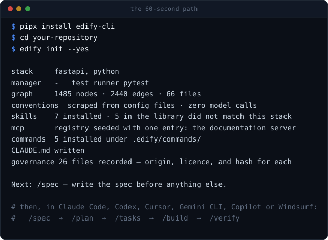
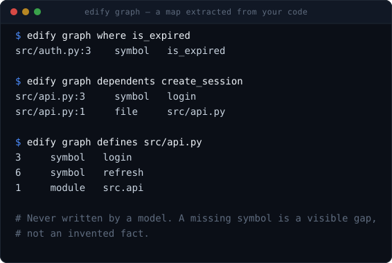
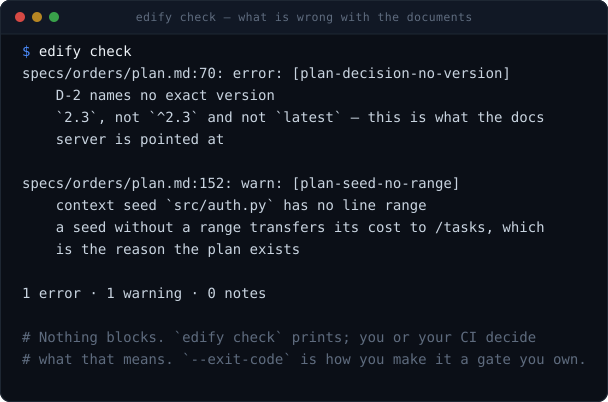
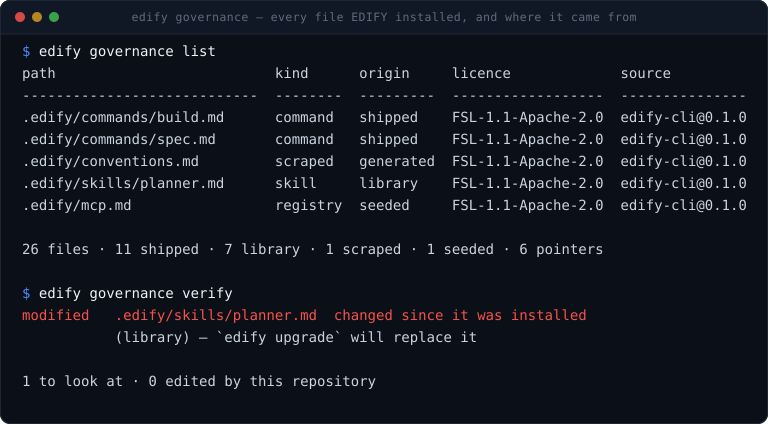
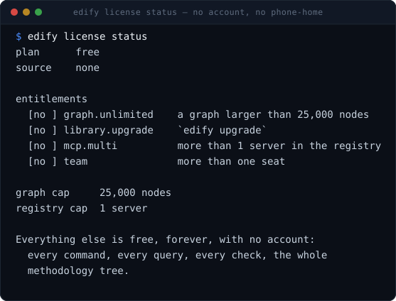

<div align="center">



# EDIFY

### Your coding agent is fast. Make it reliable.

EDIFY gives Claude Code, Codex, Cursor and other agents the right codebase
context, a precise implementation plan, and independent verification for every
change.

[](https://pypi.org/project/edify-cli/)
[](https://pypi.org/project/edify-cli/)
[](https://github.com/EDIFY-agents/edify_public/actions/workflows/ci.yml)
[](docs/license.md)
[](docs/privacy.md#the-supply-chain)
[](docs/privacy.md)

**Local-first · No telemetry · Works with your existing coding agent**

[Quickstart](docs/quickstart.md) · [Docs](docs/) · [How it works](#how-it-works) ·
[Benchmarks](docs/benchmarks.md) · [Pricing](docs/pricing.md)

</div>

---

## Install

```bash
pipx install edify-cli          # or: uv tool install edify-cli
cd your-repository
edify init
```

Python 3.10+ is the whole requirement. No dependencies, no compiler, no runtime
to install on a build server. macOS, Linux, and Windows from the same artifact.

···  `pipx install edify-cli` · `edify init --yes`



Then, in whichever agent you already use:

```
/spec  →  /plan  →  /tasks  →  /build  →  /verify
```

---

## The problem

**AI-generated changes are fast to produce. They are still expensive to trust.**

A frontier model with a plain setup writes excellent code and still fails on
serious projects. Not from lack of intelligence — from three things that happen
on every large codebase, and that no model generation fixes:

- **The agent loses the map.** Every session starts blind and re-derives the same
  repository structure, expensively and slightly differently each time.
- **Every session reinterprets the work.** The same task, done in parts, in
  different ways, never as one whole — and decisions get silently re-made.
- **The change looks right and is not.** It violates an intent, an architectural
  boundary, a version, or a dependency that nobody wrote down.

EDIFY closes exactly those and gets out of the way of everything else.

---

## How it works

```
BRIEF  →  SPEC  →  PLAN  →  TASKS  →  BUILD  →  VERIFY
```

**Think hard once. Then build without thinking.**

| command | what it does | model | ends at |
|---|---|---|---|
| `/spec` | a brief becomes a specification | strongest | a human |
| `/plan` | spec → technology decisions and milestones | strongest | a human |
| `/tasks` | spec + plan + graph → a phased task list | strongest | a human |
| `/build` | task list → working software | cheapest that follows instructions | a diff and a green suite |
| `/verify` | the code → evidence | strong, and never a session that wrote code | a report anyone can read |

The first three are slow and expensive and end at a human reading them. The
fourth is fast and cheap and ends at working software. `/verify` can be re-run by
anyone, at any time, including six months later.

---

## The codebase graph

**A map extracted from your code. Not invented by another model.**

···  `edify graph where` · `dependents` · `defines`



```bash
edify graph where isExpired            # → src/auth/clock.ts:12  symbol  isExpired
edify graph dependents createSession   # everything that breaks if it changes
edify graph defines src/api/router.ts  # what this file exports
edify graph references generate        # who calls or imports this
edify graph overlap "a.ts b.ts" "c.ts" # can these two tasks run at once
```

Every file, module, exported symbol, route and table, with the edges between
them, as sorted checksummed text. A rebuild over unchanged source is
byte-identical, so a graph diff is a structural diff of the codebase.

**It is never written by a model** — not at install, not as a fallback, not for a
language the extractor does not cover. Where a language is not covered the graph
has no nodes for it and says so. A missing symbol is a visible gap; an invented
one is a guess wearing the costume of a fact.

Python is parsed with a real syntax tree; everything else is covered by a
declarative line scanner, or parse-grade with Universal Ctags installed. The
metadata records which, so a scan is never mistaken for a parse.

→ [docs/graph.md](docs/graph.md)

---

## Works with your agent

**EDIFY is not another coding agent. It makes your existing one more reliable.**

| | |
|---|---|
| **Claude Code** | works with your existing agent |
| **OpenAI Codex** | same workflow, different runtime |
| **Cursor** | EDIFY adds structure around the agent |
| **Gemini CLI** | agent-agnostic workflow |
| **GitHub Copilot** | use the agent you already pay for |
| **Windsurf** · **AGENTS.md** | broad compatibility |

```bash
edify init new .          # set a folder up for every runtime at once
```

One methodology in one place, with thin pointers under each runtime's own command
directory — so `/spec` resolves in whichever tool you are typing into.

→ [docs/agents.md](docs/agents.md)

---

## Verification comes first

**Define correct before implementation. Verify independently at the end.**

Phase 2 of every build turns each assertion in the spec into an executable test
that **fails**, before any core logic exists. Everything after that is making red
go green.

That is what makes a cheap builder safe: it is not judging whether its work is
correct, it is hitting a target that already exists, and progress is a number
anyone can watch instead of a claim anyone has to trust.

···  `edify check`



**Nothing blocks.** `edify check` prints; a person or a CI job decides what that
means. If you want a hard gate, that is `edify check --exit-code` in your own CI,
owned by you — and we say so rather than implying we ship one.

→ [docs/verification.md](docs/verification.md)

---

## Benchmarks

**Same model. Same repo. Same task.**

| metric | agent alone | Spec Kit | EDIFY |
|---|---|---|---|
| tasks passed | — | — | — |
| human interventions | — | — | — |
| retries | — | — | — |
| tokens / cost | — | — | — |
| total time | — | — | — |

> **Benchmark in progress. Methodology and results will be public** — including
> the tasks where EDIFY loses. The table is published empty on purpose. A
> benchmark filled in before the benchmark ran is the fastest way to lose a
> technical audience.

→ [docs/benchmarks.md](docs/benchmarks.md) — methodology, baselines, and how to
reproduce it

---

## Your code stays your code

**There is no telemetry. Not anonymous, not aggregate, not opt-out.**

Nothing here reports what you ran, what repository you ran it in, or that you
installed it. Exactly two commands open a socket — `edify upgrade` and
`edify self update` — both by explicit user action, both with an offline path.

```bash
# check it yourself; CI enforces this on every push
grep -rnE '(urlopen|requests\.|httpx\.|socket\.socket)' src/
```

- No account required, ever, including for the free tier.
- The graph and every artefact live in your repository.
- Zero runtime dependencies — nothing in the supply chain but Python itself.
- Feedback works the other way round: `edify feedback` writes a file on your
  machine and prints the command *you* run to send it.

→ [docs/privacy.md](docs/privacy.md)

---

## Governance you can read

Every file EDIFY installs is recorded with its origin, licence, and hash at the
moment it landed.

···  `edify governance list` · `verify`



A control counts as governance if a person can look at it and tell whether the
work complied. A hash and a filename qualify; a promise does not.

---

## What lands in your repository

```
CLAUDE.md              # ~15 lines: what this repo is, the commands, where the graph is
AGENTS.md              # the same block, for every runtime that reads this file
.edify/
  graph/               # nodes.tsv, edges.tsv, meta — mechanical, regenerable
  skills/              # the subset your stack matched
  commands/            # the five command files
  formats/             # the three format contracts and their worked examples
  mcp.md               # the server registry: pinned, scoped per role and phase
  conventions.md       # scraped from lint/format/tsconfig/CI — no model call
  governance.tsv       # every file above: origin, provenance, licence, hash
specs/
  <feature>/
    spec.md            # what is being built and why
    plan.md            # when the feature needs one
    tasks.md           # exactly what changes, where, in what order
    verification.md    # written by /verify
```

---

## Pricing

**Free, forever, with no account.** Every command, every query, every check, the
whole methodology tree. Not a trial, and it does not expire.

| | free | pro — **$20 per user per month** |
|---|---|---|
| the methodology, every command, every graph query | ✅ | ✅ |
| graph size | 25,000 nodes | unlimited |
| `edify upgrade` — new curated library entries | — | ✅ |
| servers in the registry | 1 | unlimited |
| projects installed on one machine | 3 | unlimited |
| seats on one licence | 1 | team plan |

···  `edify license status`



Five gates and only five, all in one readable file. The licence is a signed token
verified locally with no phone-home.

→ [docs/pricing.md](docs/pricing.md)

---

## What EDIFY does not do

It does not wrap the agent runtime, host a model, or route between providers. It
does not run a server, a daemon, or a database. It does not enforce anything at
runtime. It does not attempt to make a weak model competent — it makes a
competent model efficient, and the difference is the whole product.

**It is also not for a solo developer on a small project.** A frontier model in
auto mode is already excellent there. The value starts where the codebase stops
fitting in the context window.

---

## Documentation

| | |
|---|---|
| [Quickstart](docs/quickstart.md) | install → `init` → one real task |
| [CLI reference](docs/cli.md) | every command, with real output |
| [The codebase graph](docs/graph.md) | coverage, honestly stated |
| [Verification](docs/verification.md) | evidence over assertion |
| [Works with your agent](docs/agents.md) | six runtimes, one methodology |
| [Privacy](docs/privacy.md) | no telemetry, and how to check |
| [Benchmarks](docs/benchmarks.md) | methodology, in public |
| [Pricing](docs/pricing.md) | five gates, and why each exists |
| [Troubleshooting](docs/troubleshooting.md) | what `edify doctor` is telling you |
| [FAQ](docs/faq.md) | the questions people ask first |
| [**Design dossier**](docs/design/) | the reasoning — including [every cut and what it cost](docs/design/10-what-we-dropped.md) |

---

## Development

```bash
git clone https://github.com/EDIFY-agents/edify_public && cd edify_public
pip install -e ".[dev]"
pytest
```

The test suite checks that this repository satisfies what EDIFY asks of yours:
every skill file valid and under budget, every command file short, and every
worked example parsing against the format it calibrates.

---

## Contributing

The fastest useful contribution is **running EDIFY on one real task and telling
us what broke** — `edify feedback`, or an [issue](https://github.com/EDIFY-agents/edify_public/issues/new/choose). A
[graph gap](https://github.com/EDIFY-agents/edify_public/issues/new?template=graph_gap.yml) report is the single most
valuable thing we receive.

[CONTRIBUTING.md](CONTRIBUTING.md) · [GOVERNANCE.md](GOVERNANCE.md) ·
[SECURITY.md](SECURITY.md) · [CODE_OF_CONDUCT.md](CODE_OF_CONDUCT.md) ·
[CHANGELOG.md](CHANGELOG.md)

Questions and ideas go to [Discussions](https://github.com/EDIFY-agents/edify_public/discussions); reproducible bugs go
to [Issues](https://github.com/EDIFY-agents/edify_public/issues). There is no Discord yet — when there is a recurring
community that needs one, there will be.

---

## Licence

[**FSL-1.1-Apache-2.0**](LICENSE) — the Functional Source License.

Free for **any** use except building a competing product: use it at work, on
commercial code, in production, at any company size; read it, modify it, fork it,
self-host it. **Every released version becomes Apache 2.0 two years after
release**, irrevocably.

It is source-available, not OSI open source, and we will not claim otherwise.
Two-minute plain-English version: [docs/license.md](docs/license.md).

The name is a separate grant — see [TRADEMARK.md](TRADEMARK.md). Fork freely;
rename before you ship.
