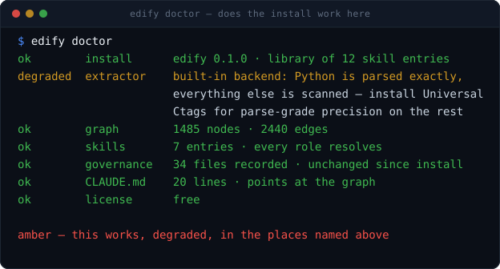

# Screenshots

Every terminal image in the docs is **generated from real output of the actual
binary**, not drawn by hand. Evidence is only worth something if it is real, so
the pipeline is committed and anyone can re-run it.

## The convention

Wherever a document shows the product working, the section is marked with `···`
and the exact command, immediately above the image:

```markdown
···  `edify doctor`


```

The `···` line tells a reader — and whoever regenerates these — precisely what to
run to reproduce the image below it.

## Regenerating

1. Run the command in a real repository and capture the output verbatim.
2. Put it in `assets/specs/<name>.txt`. The first line is `#! <title>` — what
   appears in the terminal title bar. Lines starting with `$ ` render as prompts;
   lines starting with `#` render as dim comments.
3. Render:

```bash
python tools/render_terminal.py assets/specs/doctor.txt assets/doctor.svg
```

Or all of them:

```bash
for f in assets/specs/*.txt; do
  python tools/render_terminal.py "$f" "assets/$(basename "${f%.txt}").svg"
done
```

## Why SVG

Crisp at any zoom, a few kilobytes each, diffable in review, and readable on both
GitHub themes because the terminal is dark in either. No external image host, no
binary blobs in history, and a wrong number is a one-line fix rather than a
re-shoot.

## The one exception: `pipeline.svg`

`pipeline.svg` is the animated banner at the top of the root
[`README.md`](../README.md). It is the **only** image here that is drawn rather
than captured, because it shows the shape of the workflow rather than the output
of a command — so the rule below does not apply to it and it has no transcript in
`specs/`.

It is hand-written SVG with a CSS animation on a twelve-second loop: the five
commands light up in order as the run reaches them, then the whole thing resets.
Edit the file directly. It carries no script, no external font, and no remote
reference, so GitHub renders and animates it as-is, and
`prefers-reduced-motion: reduce` gets the finished frame instead of the loop.

## The rule

**Do not edit the SVGs.** Edit the transcript in `specs/` and re-render, so the
image and the claim stay tied to a command someone can run. If a transcript is
trimmed or reflowed to fit, it stays faithful to what the command actually
printed.

| image | command |
|---|---|
| `pipeline.svg` | *drawn, not captured — the animated README banner* |
| `hero.svg` | `pipx install edify-cli` · `edify init --yes` |
| `graph-where.svg` | `edify graph where` · `dependents` · `defines` |
| `doctor.svg` | `edify doctor` |
| `verify.svg` | `edify check` |
| `governance.svg` | `edify governance list` · `verify` |
| `license.svg` | `edify license status` |
